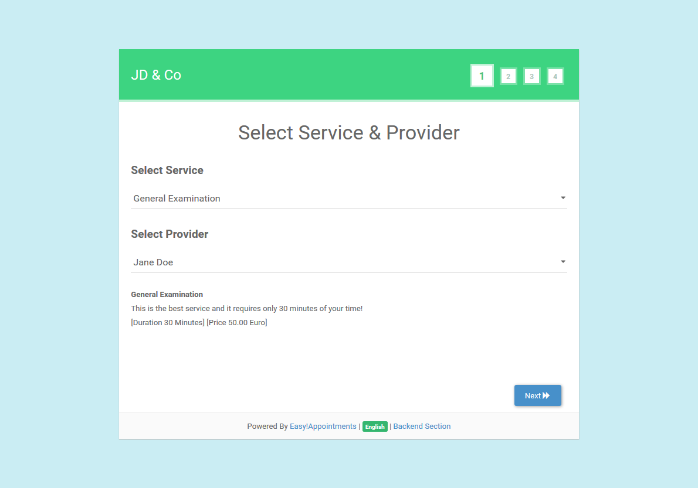

<h1 align="center">
    <br>
    <a href="https://easyappointments.org">
        
    </a>
    <br>
    Easy!Appointments
    <br>
</h1>

<br>

<h4 align="center">
    A powerful Open Source Appointment Scheduler that can be installed on your server. 
</h4>

<p align="center">
  
  
  
  <a href="https://discord.com/invite/UeeSkaw">
    
  </a>
</p>

<p align="center">
  <a href="#about">About</a> •
  <a href="#features">Features</a> •
  <a href="#setup">Setup</a> •
  <a href="#installation">Installation</a> •
  <a href="#license">License</a>
</p>



## NOTES on customizations

Changes have been made to the following:
* ./application/libraries/Availability.php - Applied a function to round to nearest half hour when pulling periods. Round up or down depending on end or start of shift/appointment/break. Used in get_available_hours
* ./application/controllers/Appointments.php ajax_get_unavailable_dates and ajax_get_available_hours (sub function "search_any_provider_mod") - now returns yesterday, today, tomorrow for all providers instead of only that day for a single provider.
* Round Robin logic inserted in - ./assets/js/frontend_book_api.js (Data from ajax_get_available_hours POST endpoint is parsed, and round robin logic applied here. 
* Exclude Step #1 on booking page so "any-provider" always selected - ./application/views/appointments/book.php AND ./assets/css/frontend.css
* ./application/libraries/Timezones.php to insert shifts as timezones that can be selected for providers
* ./application/helpers/custom_datetimezone_helper.php - helper function to stop using new DateTimeZone() constructor which would not recognize custom shifts. 
* In all instances where new DateTimeZone() was used, instead used custom_datetimezone_helper.php
* ./application/views/backend/services.php - The following options are pre-selected and readonly when creating a service because the code amendments only cater to this set of options: 
- Availability Types = Fixed
- Attendants number = 1
* Modified ./assets/js/backend_services_helper.js to add the logic for generating links that will die after 7 days. 
- this is simply at time of creation a time epoch string base64 encoded. 
- It is reverse encoded when loading the booking page to optionally deny bookings.
* Modified controller ./application/controllers/Appointments.php - to throw an error instead of loading booking view if b64 time epoch string is not included.


## About

**Easy!Appointments** is a highly customizable web application that allows customers to book appointments with you 
via a sophisticated web interface. Moreover, it provides the ability to sync your data with Google Calendar so you can 
use them with other services. It is an open source project that you can download and install **even for commercial use**. 
Easy!Appointments will run smoothly with your existing website as it can be installed in a single folder of the 
server and of course share an existing database.

## Features

The application is designed to be flexible enough so that it can handle any enterprise work flow. 

* Customers and appointments management.
* Services and providers organization.
* Working plan and booking rules.
* Google Calendar synchronization.
* Email notifications system.
* Self hosted installation.
* Translated user interface.
* User community support. 

## Setup

To clone and run this application, you'll need [Git](https://git-scm.com), [Node.js](https://nodejs.org/en/download/) (which comes with [npm](http://npmjs.com)) and [Composer](https://getcomposer.org) installed on your computer. From your command line:

```bash
# Clone this repository
$ git clone https://github.com/alextselegidis/easyappointments.git

# Go into the repository
$ cd easyappointments

# Install dependencies
$ npm install && composer install

# Start the file watcher
$ npm start
```

Note: If you're using Linux Bash for Windows, [see this guide](https://www.howtogeek.com/261575/how-to-run-graphical-linux-desktop-applications-from-windows-10s-bash-shell/) or use `node` from the command prompt.

You can build the files by running `npm run build`. This command will bundle everything to a `build` directory.

## Installation

You will need to perform the following steps to install the application on your server:

* Make sure that your server has Apache/Nginx, PHP and MySQL installed.
* Create a new database (or use an existing one).
* Copy the "easyappointments" source folder on your server.
* Make sure that the "storage" directory is writable.
* Rename the "config-sample.php" file to "config.php" and update its contents based on your environment.
* Open the browser on the Easy!Appointments URL and follow the installation guide.

That's it! You can now use Easy!Appointments at your will.

You will find the latest release at [easyappointments.org](https://easyappointments.org).
If you have problems installing or configuring the application visit the
[official support group](https://groups.google.com/forum/#!forum/easy-appointments).
You can also report problems on the [issues page](https://github.com/alextselegidis/easyappointments/issues)
and help the development progress.

## License 

Code Licensed Under [GPL v3.0](https://www.gnu.org/licenses/gpl-3.0.en.html) | Content Under [CC BY 3.0](https://creativecommons.org/licenses/by/3.0/)

---

Website [alextselegidis.com](https://alextselegidis.com) &nbsp;&middot;&nbsp;
GitHub [alextselegidis](https://github.com/alextselegidis) &nbsp;&middot;&nbsp;
Twitter [@alextselegidis](https://twitter.com/AlexTselegidis)

###### More Projects On Github
###### ⇾ [Plainpad &middot; Self Hosted Note Taking App](https://github.com/alextselegidis/plainpad)
###### ⇾ [Questionful &middot; Web Questionnaires Made Easy](https://github.com/alextselegidis/questionful)
###### ⇾ [Integravy &middot; Service Orchestration At Your Fingertips](https://github.com/alextselegidis/integravy)
